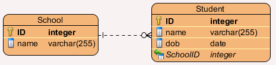
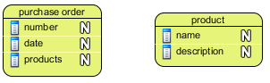
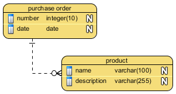
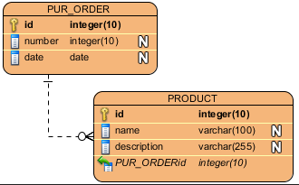

# Welcome to DB

**Warm-Up Questions:**

- Draw the app architecture for your Instagram app.
- Trace the information flow
- How do you think Instagram defines their user data? 
 

## Do you think that Instagram is using local FS and JSON file storage? Why or why not?

#### What are the advantages/disadvantages of using local FS? 

**Strengths**
- simple access
- simple structure
- easy connect with API's

**Weaknesses**
- not very robust
- simultaneous access by multiple people?
- ensuring data doesn't get corrupted?
- what if we need to move data to another server?
- what if we need to split our data into smaller chunks?
- what if we need to share only small parts of our data with other clients/servers?
- what if the computer crashes in the middle of writing? | 

Using a local FS JSON data-store is fine for small applications. But there are many potential downsides.

## A database is a much more robust alternative to using a local FS data-store.

Robust means that database tools have been specifically developed to make reading, writing, and deleting from large files easy and reliable.

### There are many popular models of Database architecture:

#### Relational
Relational databases represent data in the form of tables. Think .csv without the hassle. We're going to focus on this type of database.

- **Example:** MySQL represents data in tables and rows.

**More info:** http://www.iheavy.com/2011/07/05/relational-database-what-is-it-and-why-is-it-important/

#### Non-relational
Non-relational databases do not represent data in a table. There are many forms of non-relational datastores.

- **Example 1:** MongoDB represents data as collections of JSON documents
- **Example 2:** Our current local FS with JSON data-store.

## Data Modeling for a Relational Database
A data model provides the structure and format of data. Designing an app requires you to keep track of lots of data. How will you model that data? 

Relational databases store their information in a table. Each row of the table has exactly the same number of columns. Tables can point to other tables:

#### Use an ERD (Entity-Relationship Diagram) to draw a representation of your data model.
An Entity Relationship Diagram (ERD) is a visual representation of different data using conventions that describe how these data are related to each other.

These phases are not set in stone... Your goal is to devise the ultimate *schema* for your data. In a relational (table-based) database an entity name becomes the table name, and each entity attribute is like a column in the table.

#### Phase I: Conceptual
- Draw a big picture idea.
- Identify **Entitites**

#### Phase II: Logical
- Split your big picture into small parts.
 

#### Phase III: Physical
- Identify how your small parts will be represented. 
- How will your parts connect to each other?
 

These ERD pictures map to database tables that look like this:

**School:**

| id | name |
| --- | --- |
| 1 | W.H. Smith High | 
| 2 | Salem Church High | 
| 3 | International High | 

**Student:**

| id |name | dob | schoolid | 
| --- | --- | --- | --- |
| 1 | Megan Chills | 03-13-94 | 1 |
| 2 | Chris Chills | 03-13-94 | 1 |
| 3 | Hope Logan | 01-20-95 | 3 |
| 4 | Xavier Yu | 09-01-94 | 2 |
| 5 | Sally Mae | 12-25-93 | 3 |

#### Cardinality Rules 
Did you notice the special way the School entity is connected to the Student entity?

Cardinality describes how sometimes entities are 'shared'.

To start, we'll connect our entities in one of two ways:

- **One to one (1:1)**: Each lecturer has a unique office
- **One to many (1:M)**: A lecturer may tutor many students, but each student has just one tutor

## Draw a "Physical" ERD for the following scenario:

You're making an app that uses a unique Purchase Order to keep track of many Product Items. Product items in this case are defined by names and descriptions.

#### Phase I: Conceptual
-What are the big picture ideas?
  - Purchase orders keep track of products. Purchase orders have a date. Purchase orders have a unique number. 
  - Prouct Items need to keep track of a name and a description.

#### Phase II: Logical
- How do the different components interact?
  - Many Product Items are attached to a single Purchase Order.
- What kind of data are you working with?

#### Phase III: Physical
- What other information will you need to include in your data model to make your system actually work?
  - Both purchase ordes and product items will keep a unique id (to allow for easy searching).
  - Each product will keep track of the purchase order id it is associated with. This is like a 'parent-child' relationship.
  

#### Draw sample database tables for this ERD!

Resources:

  - https://www.draw.io/
  - https://www.lucidchart.com/pages/how-to-draw-ERD
  - Images from:  http://www.visual-paradigm.com/features/database-design/#erd
