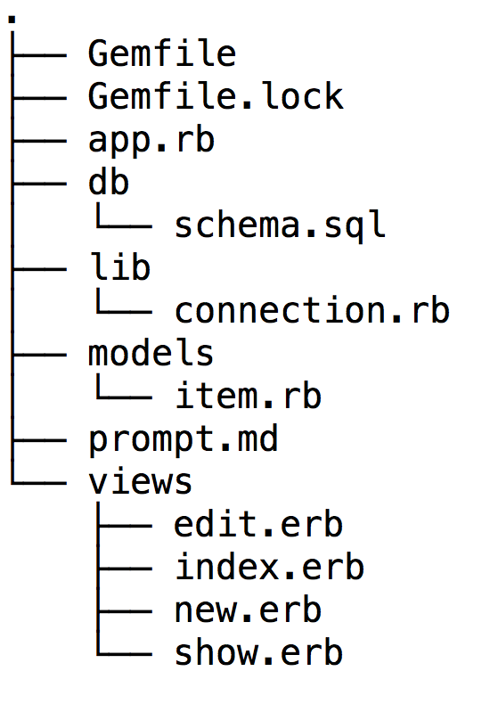

# TO-DO (or SiNATra-Do)


(queue the music)

####Goals:
 - Practice Ruby & Active Record
 - Practice working in a group to create a full-stack app
 - Gain experience learning a new technology completely via its docs

###Project Specifics
 - **Use Sinatra and Active Record to write a RESTful CRUD "TO-DO" app!** Your app will include the same folder organization that you used for both the Cheese and  Animal Farm exercises.
 - Your app must use erb templating. Add a ```"/views"``` folder to hold all of your templates.
 - Allow the user to enter a color along with the task.  Render each task with the appropriate color.

###Some Tips:

- **Your directory structure should look very similar to this**:


- **ERB templating is very similar to EJS templating** 
Here is the Sinatra route for displaying one item using the ```show.erb``` template:

In ```app.rb```-
```ruby
#display one item
get '/items/:id' do
  # Retrieve item from database
  item = Item.find(params[:id])
  # render 'show' view and pass item to view
  erb :show, locals: {item: item}
end
```
In ```show.erd```-

```html
<html>
<body>
	<h1>todo stuff!</h1>
	<p><%= item.name %></p>
	<a href="/items/<%= item.id %>/edit">Edit</a>
	
</body>
</html>
```

- **Using `_method` (Method-Overriding) for REST**
Because the arbitrary and decrepit owners of **the HTML spec** refuse to accept the thoughtful and 
far-sighted designs of **the HTTP spec**, they have not created an HTML format for natively sending 
any requests other than `GET`s (via `<a>` (anchor) tags) and `POST`s (via `<form>` tags).
In order to implement RESTful behavior (semantic HTTP, ie Web Services), we must use a workaround 
to send `PUT` (or `PATCH`) and `DELETE` requests:
```html
<form method="POST" action="/page">
  <input type="hidden" name="_method" value="PUT" />
  ...
</form>
```


